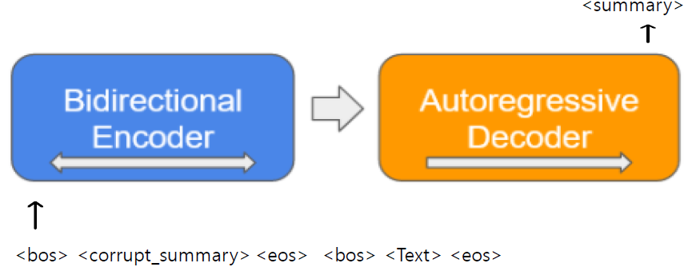

# Factual-Error-Correction-for-Abstractive-Summarization-Models

#### Paper: [Factual Error Correction for Abstractive Summarization Models](https://arxiv.org/abs/2010.08712)

## Model architecture
 
 
## Data
- [Dacon 한국어 문서 생성요약 AI 경진대회](https://dacon.io/competitions/official/235673/overview/) 의 학습 데이터 + 국립 국어원 Data set
- Dataset of Artificial Corruptions
    - Swapping strategy
        1. 본문, 요약문에 NER 
        2. Summary에서 Entity 선택 후, Text에서 Type이 같고 내용이 다른 Entity와 Swap
        3. EntitySwap, NumberSwap 두 가지 Swap 진행
      
- Data 구조
  - Clean data
    - Train data : 37752
    - Valid data : 4719
    - Test data : 4719
  - Corruption data -> corrupted 30%
    - Train data : 16178
    - Valid data : 2022
    - Test data : 2022

## How to Train
 - KoBART summarization fine-tuning
 - Finetunig에는 [KoBART](https://github.com/SKT-AI/KoBART) 사용
```
python train.py --gradient_clip_val 1.0 --max_epochs 4 --default_root_dir ./model_data  --gpus 1 \
--num_workers 3 --checkpoint_path ./model_data/kobart_summary-last.ckpt --batch_size 16
```


    
